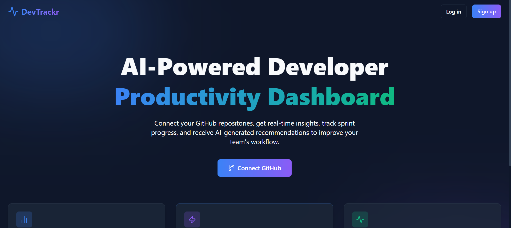
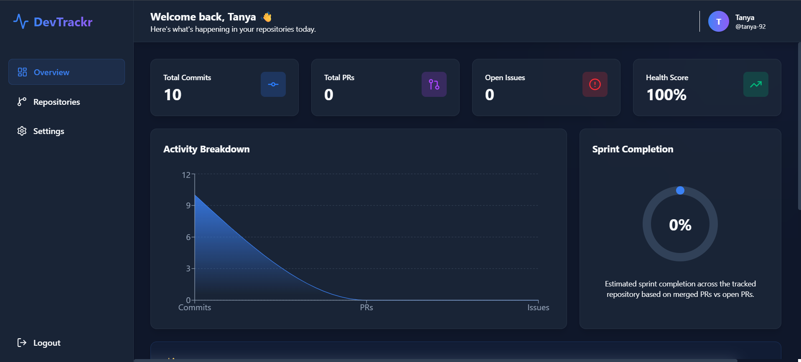
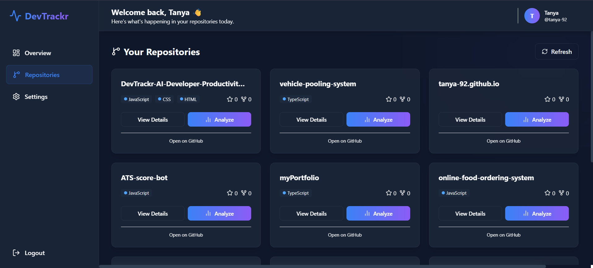
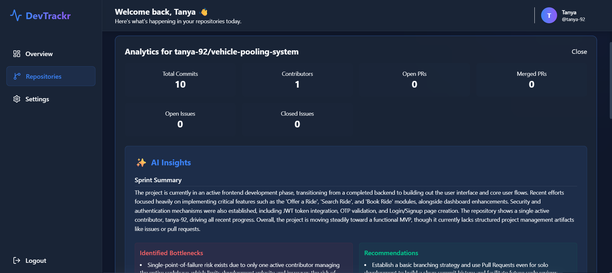
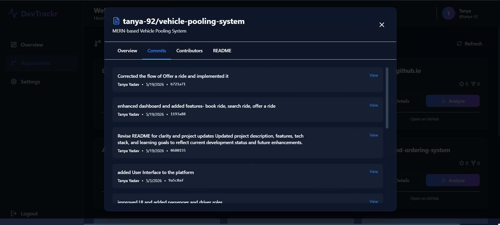

# 🚀 DevTrackr – AI-Powered Developer Productivity Dashboard

<p align="center">
  
  
  
  
  
  
</p>

---

# 🌟 Overview

DevTrackr is an AI-powered developer productivity and GitHub analytics dashboard designed to help developers and teams track repository activity, monitor sprint progress, analyze contributor performance, and generate intelligent AI-driven development insights.

The platform integrates GitHub APIs with Gemini AI to transform repository data into meaningful analytics and sprint summaries.

---

# 🎯 Project Objective

The goal of DevTrackr is to:

- Analyze GitHub repositories in real-time
- Monitor commits, pull requests, and issues
- Generate AI-powered sprint summaries
- Detect productivity bottlenecks
- Track repository health and progress
- Provide intelligent development recommendations
- Improve workflow visibility and developer productivity

---

# 🚀 Features

# 🔐 Authentication System

- Secure Signup/Login
- JWT Authentication

---

# 🔗 GitHub Integration

Users can connect their GitHub account using their GitHub username.

The platform automatically fetches:

- Public repositories
- Repository metadata
- Commit history
- Contributors
- Languages/Tech Stack
- README files
- Deployment information

---

# 🤖 AI-Powered Insights

Gemini AI generates:

- Sprint summaries
- Productivity analysis
- Bottleneck detection
- Repository health insights
- Smart recommendations

---

# 📊 Analytics Dashboard

Interactive dashboard visualizations include:

- Commit activity charts
- Pull request analytics
- Sprint completion insights
- Repository health metrics
- Issue tracking analytics
- Contributor participation
- Productivity indicators

---

# 📂 Repository Analysis

Each repository includes:

## 📌 Repository Overview

- Repository Name
- Description
- Stars
- Forks
- Open Issues
- Visibility

---

## 💻 Languages & Tech Stack

Automatically detects technologies used in repositories:

- JavaScript
- TypeScript
- Python
- Java
- React
- Node.js
- MongoDB
- Express
- Tailwind CSS

---

## 📝 Commit Analysis

Tracks:

- Recent commits
- Commit messages
- Commit frequency
- Commit authors
- Development timelines

---

## 👥 Contributor Analytics

Shows:

- Contributor count
- Contribution activity
- Developer participation
- Active vs inactive contributors

---

## 📄 README Viewer

Fetches and renders repository README files directly inside the dashboard.

Supports:
- Markdown rendering
- Repository documentation preview
- Project understanding through AI

---

# 🧠 AI Insights Generated

DevTrackr intelligently analyzes GitHub repository data and generates meaningful insights.

---

## 📌 Sprint Summary

AI generates detailed sprint summaries explaining:

- What development work happened
- Which modules/features were active
- Sprint momentum
- Repository growth

---

## 📈 Productivity Analysis

AI evaluates:

- Commit consistency
- Developer engagement
- Team activity patterns
- Development efficiency

---

## ⚠️ Bottleneck Detection

Detects:

- Low contributor activity
- Stale issues
- Slow sprint progress
- Reduced development velocity

---

## 💡 Smart Recommendations

Examples:

- Prioritize unresolved issues
- Improve contributor participation
- Increase testing coverage
- Refactor inactive modules
- Optimize sprint planning

---

# 🛠️ Tech Stack

# Frontend

- React.js (Vite)
- Tailwind CSS
- Recharts
- Axios
- React Router DOM
- Framer Motion

---

# Backend

- Node.js
- Express.js
- MongoDB Atlas
- Mongoose
- JWT Authentication
- bcrypt.js

---

# APIs & Integrations

- GitHub REST API
- Gemini AI API

---

# Deployment

- Vercel (Frontend)
- Render (Backend)
- MongoDB Atlas (Database)

---

# 🏗️ Project Architecture

```bash
DevTrackr/
│
├── frontend/
│   ├── src/
│   ├── components/
│   ├── pages/
│   ├── services/
│   ├── charts/
│   └── context/
│
├── backend/
│   ├── controllers/
│   ├── middleware/
│   ├── routes/
│   ├── services/
│   ├── models/
│   ├── utils/
│   └── config/
│
└── README.md
```

---

# 🔄 Application Workflow

```text
User Signup/Login
        ↓
Connect GitHub Username
        ↓
Fetch Repository Data using GitHub API
        ↓
Store Data in MongoDB
        ↓
Analyze Repository
        ↓
Gemini AI Generates Insights
        ↓
Dashboard Displays Analytics
```

---

# 📸 Screenshots

# Landing Page

<p align="center">
  
</p>

---

# Dashboard

<p align="center">
  
</p>

---

# Repositories

<p align="center">
  
</p>

---

# Analytics

<p align="center">
  
</p>

---

# Repositories Details Card

<p align="center">
  
</p>

# 🌐 Deployment

# [Visit DevTrackr](https://dev-trackr-ai-developer-productivit-nu.vercel.app/)

# Frontend Deployment

Platform:
- Vercel

---

# Backend Deployment

Platform:
- Render

---

# Database

Platform:
- MongoDB Atlas

---


# 👩‍💻 Author

# Tanya Yadav

- Full Stack Developer
- MERN Stack Enthusiast
- AI & Web Development Learner

## GitHub

```md
https://github.com/tanya-92
```

---

ce.
